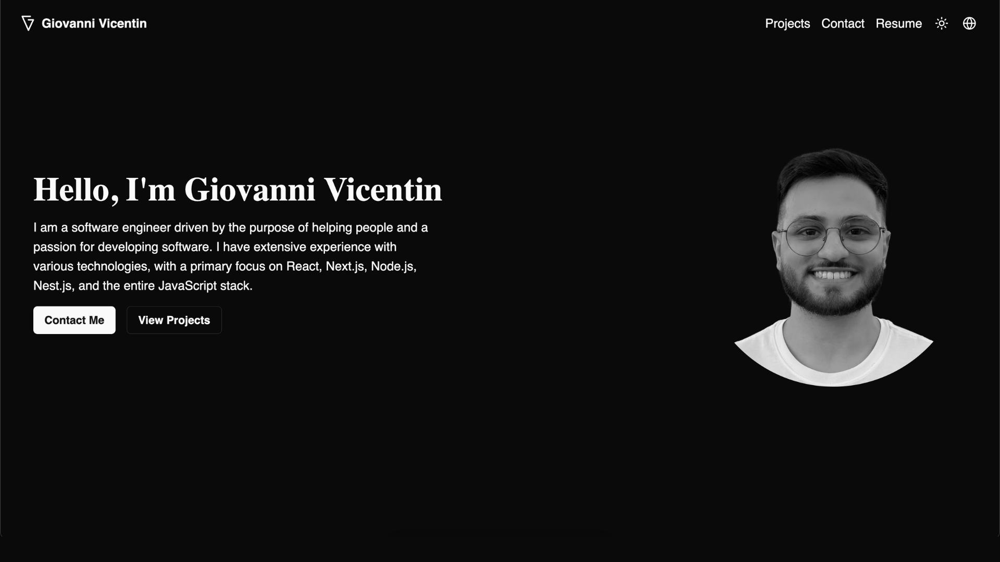

# giovannivicentin.com

### Welcome to the repository for my professional portfolio website, [giovannivicentin.com](https://giovannivicentin.com). This minimalist, sleek, and responsive portfolio showcases my work as a software engineer, featuring my projects, skills, and professional experiences.




## Features

- **Internationalization**: Available in English (default), Spanish, and Portuguese.
- **Dark/Light Mode**: Theme toggle to switch between dark and light modes.
- **Responsive Design**: Optimized for all devices.
- **Projects Showcase**: Each project is presented with descriptions, and clicking on a project displays a video preview for a more interactive experience.
- **Interactive Components**: Custom components using Radix UI and React Hook Form for a dynamic experience.
- **Send Email in Footer:** Contact me directly via email in the footer.

## Technologies Used

The project is built with modern, performant web technologies:

- **Framework**: [Next.js](https://nextjs.org/) (v14)
- **Styling**: [Tailwind CSS](https://tailwindcss.com/) with custom animations from `tailwindcss-animate`
- **Forms**: [React Hook Form](https://react-hook-form.com/) for efficient form management
- **Validation**: [Zod](https://zod.dev/) for schema-based form validation
- **UI Components**: Radix UI with Shadcn for accessible and flexible components
- **Internationalization**: [next-intl](https://next-intl.vercel.app/) for handling multiple languages
- **Image Processing**: [Sharp](https://sharp.pixelplumbing.com/) for optimized images
- **Analytics**: Vercel Analytics and Speed Insights for performance monitoring

## Setup Instructions

1. **Clone the repository**:
	```bash
	git clone https://github.com/giovannivicentin/giovannivicentin.com.git
	cd giovannivicentin.com
	```

2.	Install dependencies:
	```bash
	npm install
	```

3.	Run in development mode:
	```bash
	npm run dev
	```

4.	Build for production:
	```bash
	npm run build
	```

5.	Start the production server:
	```bash
	npm start
	```

### Scripts in package.json:

1. 	npm run dev: Starts the development server
2. 	npm run build: Builds the project for production
3. npm run start: Runs the production build
4. npm run lint: Runs ESLint with automatic fixing

## License

This project is licensed under the MIT License.

## Contact

If you have any questions or would like to connect, feel free to reach out via [LinkedIn](https://www.linkedin.com/in/giovannivicentin/).
