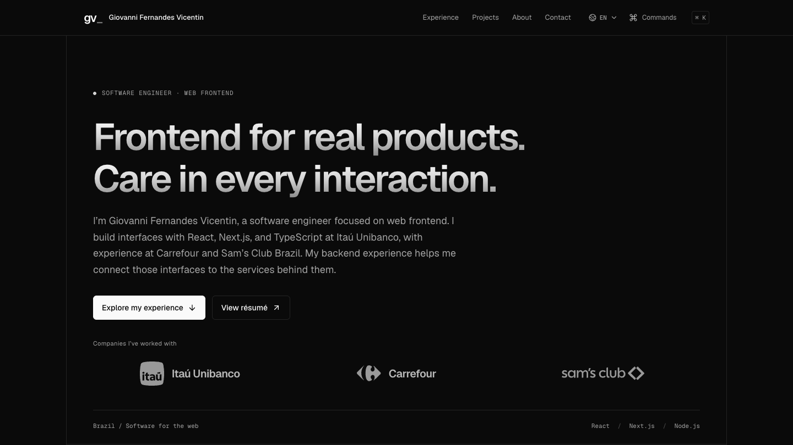

# Giovanni Vicentin

**Frontend for real products. Care in every interaction.**

My personal portfolio — a selection of professional experience, independent projects, and the work behind the interfaces I build.

[Visit the portfolio](https://www.giovannivicentin.com/en) · [LinkedIn](https://www.linkedin.com/in/giovannivicentin/) · [Email](mailto:giovannifvicentin@gmail.com)

[](https://www.giovannivicentin.com/en)

## About

I’m a software engineer based in Brazil, focused on web frontend with React, Next.js, and TypeScript. My experience includes Itaú Unibanco, Carrefour, and Sam’s Club Brazil, alongside personal projects that turn ideas into useful web experiences.

The site brings that work together in a quiet, monochrome interface, with Geist typography, subtle motion, and space for the content to lead.

## The site

- Available in English, Portuguese, and Spanish.
- Responsive layouts for desktop and mobile.
- Keyboard navigation and a command palette with `⌘ K` / `Ctrl K`.
- Motion that respects reduced-motion preferences.
- Direct access to my projects, résumé, and contact details.

## Built with

Next.js · React · TypeScript · Tailwind CSS · shadcn/ui · next-intl · Motion

## Run locally

```sh
npm install
npm run dev
```

Open [localhost:3000](http://localhost:3000).

To build and run the production version:

```sh
npm run build
npm start
```
